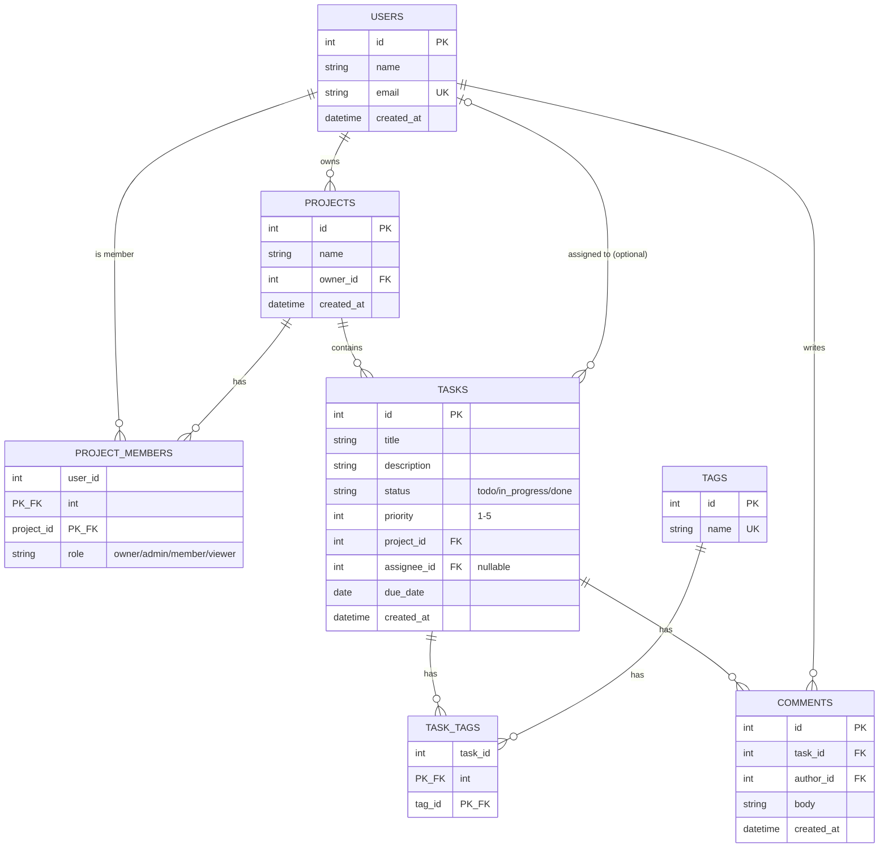

# Task Management Platform — System Design Document

## 1. Overview and Requirements

### Overview
The Task Management platform is a collaborative work-tracking system where teams organize their work into projects. Users can create projects, invite other users as members with specific roles (owner, admin, member, viewer), and manage tasks within those projects. Tasks can be assigned to a single user, tagged for categorization, and discussed through threaded comments. Access to project data is controlled by each user's role, so the system supports both open collaboration and controlled visibility.

### Functional Requirements
1. Users can create, update, and delete projects, with each project belonging to exactly one owner.
2. Project owners and admins can invite users as project members and assign them a role (owner, admin, member, or viewer).
3. Members can create tasks within a project, assign a task to one user, tag it with one or more tags, and comment on it.

### Non-Functional Requirements
1. **Performance** — Read endpoints must respond within 200ms and write endpoints within 500ms under normal load.
2. **Security** — All authenticated endpoints must reject requests without a valid access token, and passwords must be stored using a one-way hash (bcrypt), never plaintext.
3. **Availability** — The system should target 99.5% uptime, with read endpoints remaining available even during a brief write-path outage.

---

## 2. Entity Relationship Diagram

All 7 tables from the fixed domain are represented. `task_tags` is the many-to-many join between tasks and tags. `project_members` uses a composite primary key on `(user_id, project_id)`. `tasks.assignee_id` is optional (nullable), shown with the `|o` optional notation.

---