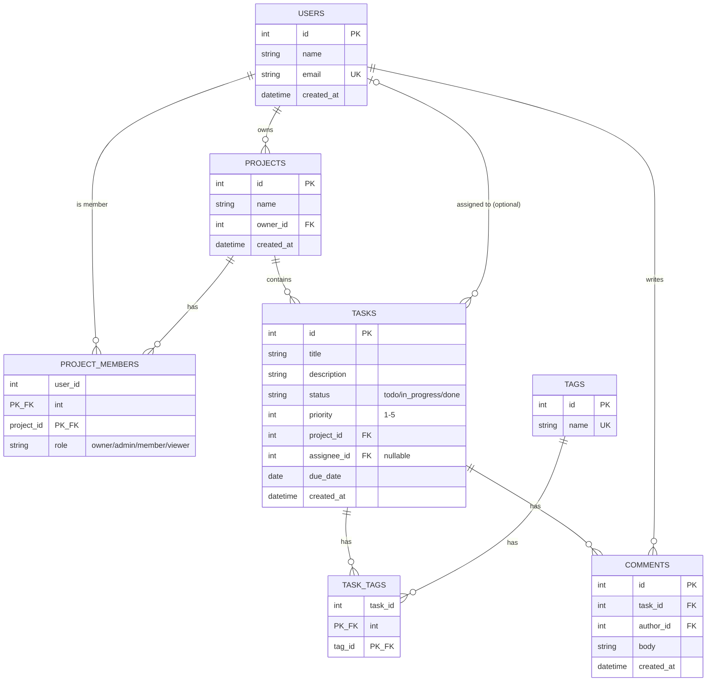

# Task Management Platform — System Design Document

## 1. Overview and Requirements

### Overview
The Task Management platform is a collaborative work-tracking system where teams organize their work into projects. Users can create projects, invite other users as members with specific roles (owner, admin, member, viewer), and manage tasks within those projects. Tasks can be assigned to a single user, tagged for categorization, and discussed through threaded comments. Access to project data is controlled by each user's role, so the system supports both open collaboration and controlled visibility.

### Functional Requirements
1. Users can create, update, and delete projects, with each project belonging to exactly one owner.
2. Project owners and admins can invite users as project members and assign them a role (owner, admin, member, or viewer).
3. Members can create tasks within a project, assign a task to one user, tag it with one or more tags, and comment on it.

### Non-Functional Requirements
1. **Performance** — Read endpoints must respond within 200ms and write endpoints within 500ms under normal load.
2. **Security** — All authenticated endpoints must reject requests without a valid access token, and passwords must be stored using a one-way hash (bcrypt), never plaintext.
3. **Availability** — The system should target 99.5% uptime, with read endpoints remaining available even during a brief write-path outage.

---

## 2. Entity Relationship Diagram

All 7 tables from the fixed domain are represented. `task_tags` is the many-to-many join between tasks and tags. `project_members` uses a composite primary key on `(user_id, project_id)`. `tasks.assignee_id` is optional (nullable), shown with the `|o` optional notation.

---

## 3. Architecture

### Layers

| Layer | Responsibility |
|---|---|
| Client | Sends HTTP requests, renders UI, stores the access token |
| Controller | Parses the request, validates the DTO shape, calls the service, maps results to HTTP status codes |
| Service | Business logic — role/permission checks, orchestrating multiple repository calls, enforcing invariants |
| Repository | TypeORM queries — the only layer that talks to the database directly |
| Database | PostgreSQL — persists and enforces referential integrity (FKs, uniqueness) |

### Trace: "Create a Task"

1. **Client** sends `POST /api/v1/projects/:projectId/tasks` with a JSON body (`title`, `description`, `priority`, `assigneeId?`) and a Bearer access token.
2. **Controller** validates the incoming body against a `CreateTaskDto` (class-validator). If the shape is invalid → returns `400 Bad Request` immediately, service is never called.
3. **Controller** extracts the authenticated user from the token and passes `(projectId, userId, dto)` to the **Service**.
4. **Service** checks the user's `project_members` role for `projectId`. If the user is not a member → `403 Forbidden`. If the project doesn't exist → `404 Not Found`.
5. **Service** checks role permission — a `viewer` cannot create tasks → `403 Forbidden`.
6. **Service** builds a `Task` entity and calls the **Repository** to persist it.
7. **Repository** runs the `INSERT` via TypeORM, enforcing the `project_id` foreign key.
8. **Database** persists the row and returns the generated `id`.
9. **Repository → Service → Controller**: the new entity flows back up. Controller maps it to the response DTO and returns `201 Created` with the task body.

**Data crossing boundaries:** a validated DTO goes in at the Controller→Service boundary; a TypeORM entity comes back at the Repository→Service boundary; a response DTO goes out at the Controller→Client boundary.

**Status code mapping:** invalid body → `400`, no membership/role → `403`, project not found → `404`, success → `201`.

---