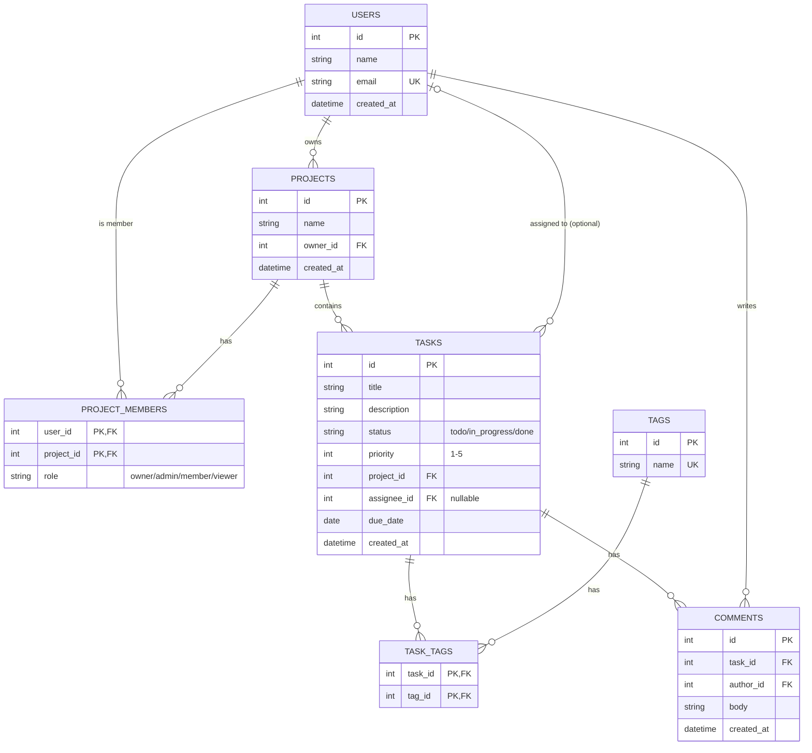

# Task Management Platform — System Design Document

## 1. Overview and Requirements

### Overview
The Task Management platform is a collaborative work-tracking system where teams organize their work into projects. Users can create projects, invite other users as members with specific roles (owner, admin, member, viewer), and manage tasks within those projects. Tasks can be assigned to a single user, tagged for categorization, and discussed through comments (a single flat comment list per task — no nested replies). Access to project data is controlled by each user's role, so the system supports both open collaboration and controlled visibility.

### Functional Requirements
1. Users can create, update, and delete projects, with each project belonging to exactly one owner.
2. Project owners and admins can invite users as project members and assign them a role of `admin`, `member`, or `viewer`. Only a dedicated ownership-transfer action changes who holds `owner`, and a project always has exactly one.
3. Any project member with write access — `owner`, `admin`, or `member` role — can create tasks within a project, assign a task to one user, tag it with one or more tags, and comment on it. The `viewer` role is read-only: it can view tasks, tags, and comments but cannot create or modify them.

### Non-Functional Requirements
1. **Performance** — Read endpoints must respond within 200ms and write endpoints within 500ms under normal load.
2. **Security** — All authenticated endpoints must reject requests without a valid access token, and passwords must be stored using a one-way hash (bcrypt), never plaintext.
3. **Availability** — The system should target 99.5% uptime, with read endpoints remaining available even during a brief write-path outage.

---

## 2. Entity Relationship Diagram



All 7 tables from the fixed domain are represented. `task_tags` is the many-to-many join between tasks and tags. `project_members` uses a composite primary key on `(user_id, project_id)`. `tasks.assignee_id` is optional (nullable), shown with the `|o` optional notation.

**Ownership invariant.** Two fields carry ownership information: `projects.owner_id` and the `project_members` row with `role = 'owner'`. `project_members.role = 'owner'` is **authoritative** — it is what every permission check in Section 3 queries. `projects.owner_id` is a denormalized copy of the same fact, kept only for cheap lookups like "list projects I own" without a join. The invariant — **exactly one `project_members` row per project has `role = 'owner'`, and its `user_id` always equals that project's `owner_id`** — is enforced three ways so it holds under concurrency, not just by application convention:

1. **Project creation** inserts the `projects` row and its sole `owner` `project_members` row inside **one transaction**, so a project can never briefly exist with zero owners.
2. **`transferOwnership`** takes a row lock (`SELECT ... FOR UPDATE`) on the `projects` row before reading or writing anything, so two concurrent transfer attempts on the same project serialize instead of racing — the second transfer blocks until the first commits, then reads the now-current owner.
3. A **database-level partial unique index**, `UNIQUE (project_id) WHERE role = 'owner'` on `project_members`, is the hard backstop: even if application logic has a bug, Postgres itself rejects a second `owner` row for the same project.

Both fields are written together, in the same transaction, only by `transferOwnership` — never by the generic member-role-update endpoint, and never by an admin's role assignment (see Requirement 2).

---

## 3. Architecture

### Layers

| Layer | Responsibility |
|---|---|
| Client | Sends HTTP requests, renders UI, stores the access token |
| Guard | Runs **before** the Controller (NestJS executes guards before interceptors — see the Concurrency note). A fast, non-locking, defense-in-depth filter: rejects most unauthorized requests early without opening a transaction. Never the authoritative check. |
| Controller | Parses the request, validates the DTO shape, calls the service, maps results to HTTP status codes |
| Service | Business logic — opens the transaction, performs the *authoritative* locked permission re-check, orchestrates repository calls, enforces invariants |
| Repository | TypeORM queries — the only layer that talks to the database directly |
| Database | PostgreSQL — persists and enforces referential integrity (FKs, uniqueness) |

### Trace: "Create a Task"

1. **Client** sends `POST /api/v1/projects/:projectId/tasks` with a JSON body (`title`, `description`, `priority`, `assigneeId?`, `tagIds?: number[]`) and a Bearer access token.
2. **Guard** (`RolesGuard`) runs first, before the Controller method executes. It reads `projectId` from the route param and `userId` from the token (parsed by an earlier `AuthGuard`), then issues a plain, non-locking `SELECT` against the primary for the user's `project_members` row. Project missing or caller not a member → `404`. Member but insufficient role (`viewer`) → `403`. This is a cheap fast-path filter only — it does **not** hold a lock, and it is **not** the authoritative check (see the Concurrency note for why).
3. **Controller** validates the body against `CreateTaskDto` (class-validator), including `tagIds` as an optional array of existing tag IDs. Invalid shape → `400 Bad Request`, Service is never called.
4. **Controller** extracts `userId` from the token and passes `(projectId, userId, dto)` to the **Service**.
5. **Service** opens a database transaction and, as its first statement, **re-reads the same `project_members` row with `SELECT ... FOR SHARE`** — this second read is the *authoritative* check, not step 2. If the row no longer grants access (revoked between steps 2 and 5), the transaction returns `403`/`404` here and nothing is written.
6. **Service** validates every ID in `tagIds` exists in `tags` — an unknown tag ID → `400 Bad Request`, transaction rolled back.
7. **Service** builds the `Task` entity and calls the **Repository** to persist it, along with one `task_tags` row per `tagId`, all inside the same transaction opened in step 5.
8. **Repository** runs `INSERT INTO tasks`, then `INSERT INTO task_tags` for each tag, enforcing the `project_id` and `tag_id` foreign keys.
9. **Database** persists the rows; the transaction **commits**.
10. **Repository** increments the project's cache version counter (Section 4) immediately after the commit, then the new `Task` entity (with its attached tags) flows back up through Service → Controller, which returns `201 Created`.

**Concurrency note — why the check happens twice.** NestJS's request pipeline runs **guards before interceptors** (Middleware → Guards → Interceptors → Pipes → Handler). That ordering means a transaction opened by an interceptor can never wrap a guard's database read — the guard has already finished by the time any interceptor runs. An earlier version of this document incorrectly assumed the opposite. The actual fix: the Guard's check (step 2) is deliberately **not** trusted as authoritative — it only rejects the common case cheaply. The **Service** (step 5) opens its own transaction and re-reads the same row with `SELECT ... FOR SHARE`, and *that* read is what's authoritative. A role revocation that commits between steps 2 and 5 is caught by step 5's re-read, not silently missed — the guard passing a request through is never sufficient on its own to authorize the write.

**Data crossing boundaries:** a validated DTO goes in at the Controller→Service boundary; a TypeORM entity comes back at the Repository→Service boundary; a response DTO goes out at the Controller→Client boundary.

**Status code mapping:** invalid body or unknown `tagId` → `400`, project not found or caller not a member → `404`, member but insufficient role → `403`, success → `201`.

---

## 4. Non-Functional Plan

### Caching
The read `GET /api/v1/projects/:id/tasks` (a project's task list) is cached — but **authorization runs first, and always against the primary**: the Service's membership/role check (Section 3, steps 4–5) executes before the cache is ever touched, and that query is deliberately excluded from the read-replica routing below — it always hits the primary directly, so a revocation is visible the instant it commits, with no replication-lag window. A non-member or revoked user therefore gets `403`/`404` from live, authoritative data and can never receive a cached response.

Only after authorization passes against the primary is the cache consulted, keyed as `projectId:version:cursor:pageSize:status:sort`. **The `version` counter deliberately does *not* live in Postgres** — the domain's schema is fixed for this assignment (Section 2), so no `tasks_cache_version` column can be added to `projects`. Instead, `version` is a plain integer maintained by the cache store itself (e.g., Redis `INCR project:{id}:tasks-version`), which is atomic on its own but cannot share a single ACID transaction with the Postgres write. That cross-system gap is bounded, not ignored: after the task `INSERT`/`UPDATE`/`DELETE` transaction **commits successfully**, the request handler calls `INCR` synchronously, with up to 2 inline retries, before returning the response. If all retries fail (rare — same datacenter, sub-millisecond call), the task write itself is still authoritative and the request still returns `201`/`200` — a failed increment is logged, and the **30-second TTL is the hard backstop**: even in that failure case, the stale cache entry cannot outlive 30 seconds. This is a deliberate trade-off — perfect cross-system atomicity isn't achievable without adding schema the assignment fixes, so the design bounds the blast radius instead of pretending the gap doesn't exist.

### Authorization always reads the primary
Every `project_members` and `projects`-existence check — anywhere in the API, not only task creation — is explicitly excluded from the read-replica routing described below and is always issued against the primary. This is the one query class deliberately never sent to a replica, because access-control correctness cannot tolerate replication lag: the "role revocation is immediate" guarantee in Challenge X2 depends on it. Only the actual data payload (task rows, project rows, comment rows returned to an already-authorized caller) is eligible for replica routing.

### Scaling — Read Replica
Write traffic (`POST`/`PATCH`/`DELETE`) always goes to the primary database. Read traffic for **already-authorized data payloads** is sent to a read replica by default. **Cost accepted: replication lag** — a replica can be milliseconds to a few seconds behind the primary. (Authorization queries themselves are the one exception, per the note above.)

**Read-your-own-write guarantee.** The version-stamped cache key closes the gap on the cache side: the version bump happens right after the write commits, so any read after that point either fetches the new version's key (a guaranteed miss, forcing a fresh read) or, on a replica still lagging behind that increment, briefly sees the old version and its still-valid cached data — which is exactly the bounded replication-lag staleness already accepted, not a correctness bug. For the *writer's own* immediate next read, requests are additionally routed straight to the primary using an `X-Write-Version` value returned in the write's response, guaranteeing the writer never observes their own write as "missing."

### Consistency
The system accepts **eventual consistency** for the cached task list and for replica reads by other users — a teammate might see a new task appear up to ~30 seconds late. It requires **strong consistency** for the write path itself and for a user viewing their own just-created/updated resource.

---

## 5. Trade-offs

### Trade-off 1: Cursor pagination vs. offset pagination
- **Chosen:** Cursor pagination for `GET /tasks` list endpoints.
- **Rejected:** Offset pagination (`?page=&pageSize=`) — its real advantage is simplicity and the ability to jump to an arbitrary page number (e.g., "go to page 40"), which cursor pagination cannot do.
- **Criterion:** Task lists are inserted into frequently and can grow large within an active project. Offset pagination shifts and duplicates/skips rows when new tasks are inserted between page loads; cursor pagination stays stable under concurrent inserts.

### Trade-off 2: Role enforcement in a guard vs. in every service method
- **Chosen:** A centralized NestJS `RolesGuard` reading a `@Roles()` decorator on each route.
- **Rejected:** Checking roles manually inside each service method — its real advantage is fine-grained flexibility (a single method could apply different rules per field), which a route-level guard cannot easily do.
- **Criterion:** The API has 20+ endpoints across 5 resources. A single missed manual check is a security hole; a guard applied at the route level cannot be forgotten once applied consistently, so consistency was weighted over per-field flexibility.
- **Guard contract:** the guard reads `projectId` from the route param (e.g. `:id` in `/projects/:id/tasks`) and the authenticated `userId` from the request object (set by an earlier `AuthGuard` that parsed the JWT), then runs a **non-locking** `project_members` lookup as a fast-path filter. It is **not** the authoritative check — NestJS runs guards before interceptors, so no transaction can wrap the guard's read. The Service performs the real, lock-holding re-check inside its own transaction immediately before writing (see Section 3's Concurrency note). This means every write endpoint pays two reads — a cheap unlocked one in the guard, an authoritative locked one in the Service — which is the accepted cost of correct authorization under NestJS's fixed pipeline ordering.

### Trade-off 3: Caching on top of the read replica vs. relying on the replica alone
- **Chosen:** Route ordinary reads to the replica (Section 4) **and additionally** cache the one disproportionately hot read — the project task list.
- **Rejected:** Relying on the read replica alone for every read, including the task list — its real advantage is architectural simplicity: one consistency model (replication lag only), with no separate cache-invalidation logic to build or reason about.
- **Criterion:** The task list is requested on nearly every page load in the UI, far more often than any other read. Shaving its latency below even a replica read justifies the extra cache-invalidation complexity for that one endpoint specifically; every other read relies on the replica alone with no cache layer.

### Trade-off 4: Normalized comment count vs. denormalized `comment_count` column
- **Chosen:** Keep `comments` normalized — count is computed with `COUNT(*)` at read time.
- **Rejected:** Storing `tasks.comment_count` directly — its real advantage is a much faster read for task lists that show comment counts (no join/aggregate needed).
- **Criterion:** Comment counts are not on the hot path yet (they appear only on a task detail view, not the list), so the write-complexity cost of keeping a denormalized counter in sync isn't justified today. (See Challenge X3 for the design if this changes.)

---

## Challenge (Optional — Extra Marks)

### X1. Sequence Diagram

```mermaid
sequenceDiagram
    participant Client
    participant Guard
    participant Controller
    participant Service
    participant Repository
    participant Database
    participant Cache

    Client->>Guard: POST /api/v1/projects/:id/tasks (Bearer token)
    Guard->>Database: SELECT project_members (non-locking, fast-path only)
    Database-->>Guard: project + membership row (or none)
    alt project missing or not a member
        Guard-->>Client: 404 Not Found
    else member with insufficient role
        Guard-->>Client: 403 Forbidden
    else guard passes (not yet authoritative)
        Guard->>Controller: forward request
        Controller->>Controller: validate CreateTaskDto (incl. tagIds)
        alt invalid body or unknown tagId
            Controller-->>Client: 400 Bad Request
        else valid body
            Controller->>Service: createTask(projectId, userId, dto)
            Service->>Database: BEGIN; SELECT project_members ... FOR SHARE
            Database-->>Service: current membership row (authoritative)
            alt revoked since Guard's check
                Service-->>Controller: throw ForbiddenException/NotFoundException
                Controller-->>Client: 403/404 (ROLLBACK)
            else still authorized
                Service->>Repository: insertTask(entity, tagIds)
                Repository->>Database: INSERT INTO tasks
                Repository->>Database: INSERT INTO task_tags (per tagId)
                Database-->>Repository: rows written (COMMIT)
                Repository-->>Service: Task entity (with tags)
                Service->>Cache: INCR project:{id}:tasks-version
                Cache-->>Service: new version (or timeout, logged, non-fatal)
                Service-->>Controller: Task entity
                Controller-->>Client: 201 Created
            end
        end
    end
```

### X2. Where State Lives
- **Postgres (source of truth):** user identity, project membership, roles, task data, comments — anything authoritative.
- **JWT (access token):** carries only **identity** — `id` and `email` — and is valid for 15 minutes. It deliberately carries **no role or membership claim**.
- **Client:** no authorization data is trusted from the client — the token is opaque to the client, and every protected request re-queries `project_members` live from Postgres (see Section 3's trace and the sequence diagram above), never from a cached or embedded role.

**Role revocation is immediate**, not bounded by the token's lifetime: because the JWT carries identity only, revoking a role in Postgres takes effect on that user's *very next request* — there is no stale window to bound, since role state is never cached in the token to begin with. The 15-minute token lifetime governs only how long the *identity claim* is trusted before a refresh is required; it has no bearing on authorization freshness.

### X3. Denormalized Field: `tasks.comment_count`
- **Field:** `tasks.comment_count` (int, default 0).
- **Read it speeds up:** the task list view, which currently would need a `COUNT()` join per task to show comment counts.
- **Write cost accepted:** every comment `INSERT` or `DELETE` must also update the parent task's counter.
- **Mechanism:** a **database trigger** on `comments` (`AFTER INSERT` / `AFTER DELETE`) that increments/decrements `tasks.comment_count`. Chosen over application-code updates because it runs synchronously inside the same database transaction as the comment write, so it cannot drift even if the application crashes mid-request.
- **Failure mode:** if the trigger itself fails (e.g., a schema change breaks it), the comment insert/delete rolls back entirely — so the counter can never silently go out of sync, at the cost of comment writes becoming slightly slower and the trigger needing to be updated whenever the schema changes.