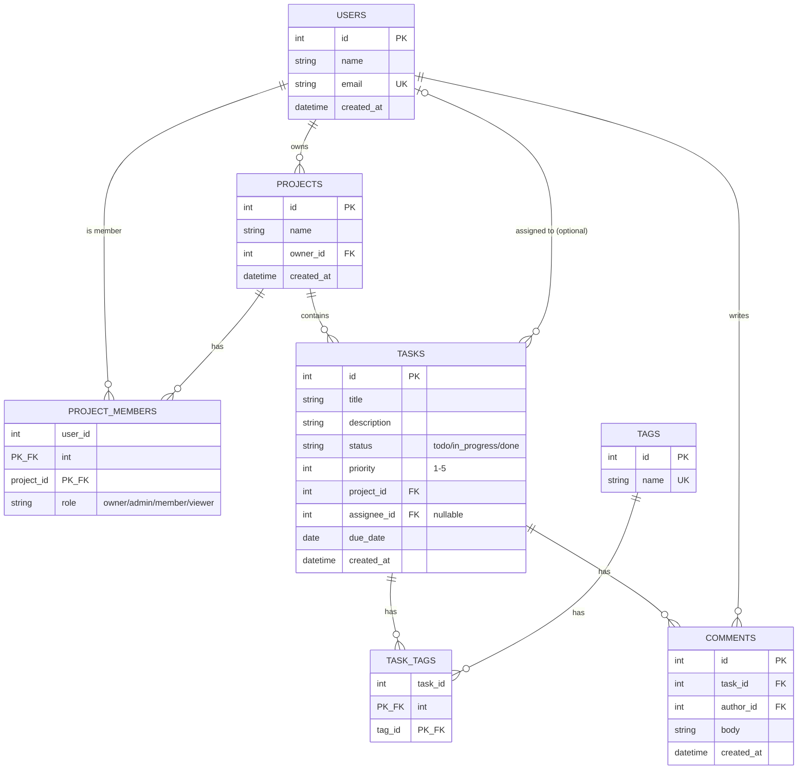
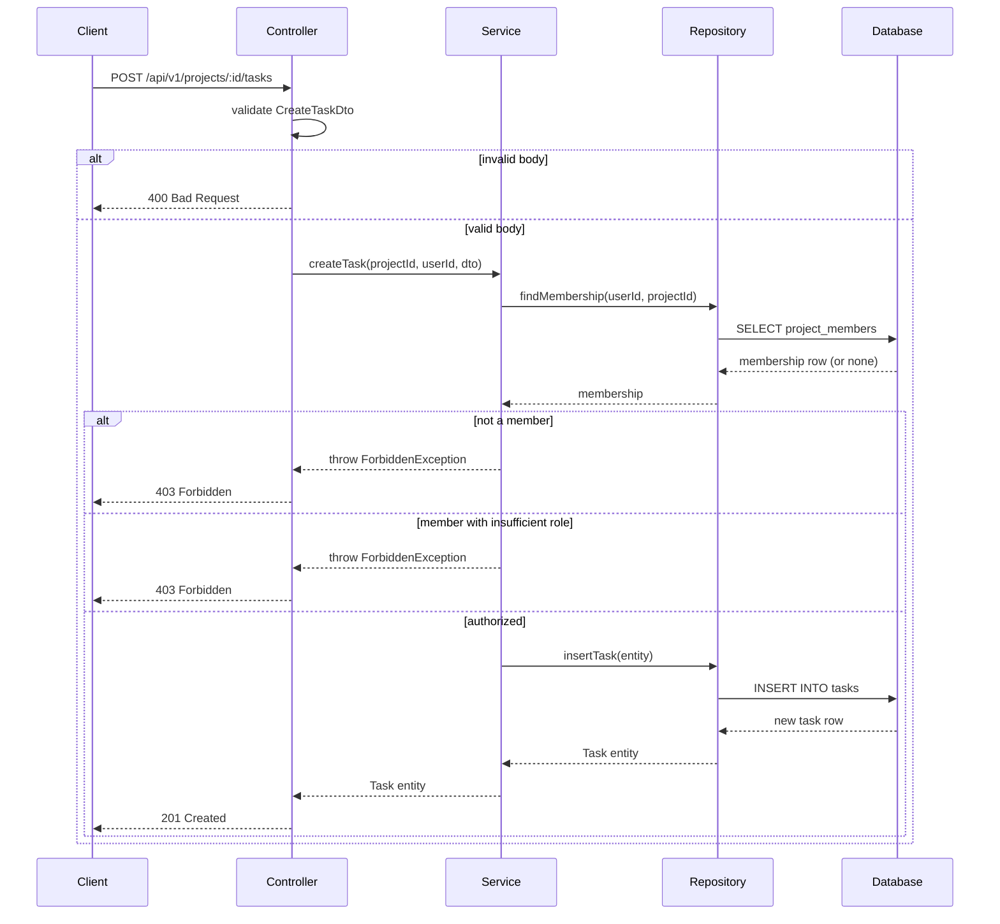

# Task Management Platform — System Design Document

## 1. Overview and Requirements

### Overview
The Task Management platform is a collaborative work-tracking system where teams organize their work into projects. Users can create projects, invite other users as members with specific roles (owner, admin, member, viewer), and manage tasks within those projects. Tasks can be assigned to a single user, tagged for categorization, and discussed through threaded comments. Access to project data is controlled by each user's role, so the system supports both open collaboration and controlled visibility.

### Functional Requirements
1. Users can create, update, and delete projects, with each project belonging to exactly one owner.
2. Project owners and admins can invite users as project members and assign them a role (owner, admin, member, or viewer).
3. Members can create tasks within a project, assign a task to one user, tag it with one or more tags, and comment on it.

### Non-Functional Requirements
1. **Performance** — Read endpoints must respond within 200ms and write endpoints within 500ms under normal load.
2. **Security** — All authenticated endpoints must reject requests without a valid access token, and passwords must be stored using a one-way hash (bcrypt), never plaintext.
3. **Availability** — The system should target 99.5% uptime, with read endpoints remaining available even during a brief write-path outage.

---

## 2. Entity Relationship Diagram

All 7 tables from the fixed domain are represented. `task_tags` is the many-to-many join between tasks and tags. `project_members` uses a composite primary key on `(user_id, project_id)`. `tasks.assignee_id` is optional (nullable), shown with the `|o` optional notation.

---

## 3. Architecture

### Layers

| Layer | Responsibility |
|---|---|
| Client | Sends HTTP requests, renders UI, stores the access token |
| Controller | Parses the request, validates the DTO shape, calls the service, maps results to HTTP status codes |
| Service | Business logic — role/permission checks, orchestrating multiple repository calls, enforcing invariants |
| Repository | TypeORM queries — the only layer that talks to the database directly |
| Database | PostgreSQL — persists and enforces referential integrity (FKs, uniqueness) |

### Trace: "Create a Task"

1. **Client** sends `POST /api/v1/projects/:projectId/tasks` with a JSON body (`title`, `description`, `priority`, `assigneeId?`) and a Bearer access token.
2. **Controller** validates the incoming body against a `CreateTaskDto` (class-validator). If the shape is invalid → returns `400 Bad Request` immediately, service is never called.
3. **Controller** extracts the authenticated user from the token and passes `(projectId, userId, dto)` to the **Service**.
4. **Service** checks the user's `project_members` role for `projectId`. If the user is not a member → `403 Forbidden`. If the project doesn't exist → `404 Not Found`.
5. **Service** checks role permission — a `viewer` cannot create tasks → `403 Forbidden`.
6. **Service** builds a `Task` entity and calls the **Repository** to persist it.
7. **Repository** runs the `INSERT` via TypeORM, enforcing the `project_id` foreign key.
8. **Database** persists the row and returns the generated `id`.
9. **Repository → Service → Controller**: the new entity flows back up. Controller maps it to the response DTO and returns `201 Created` with the task body.

**Data crossing boundaries:** a validated DTO goes in at the Controller→Service boundary; a TypeORM entity comes back at the Repository→Service boundary; a response DTO goes out at the Controller→Client boundary.

**Status code mapping:** invalid body → `400`, no membership/role → `403`, project not found → `404`, success → `201`.

---

## 4. Non-Functional Plan

### Caching
The read `GET /api/v1/projects/:id/tasks` (a project's task list) is cached, keyed by `projectId` + query params (page/status/sort). It is invalidated on any write that changes that project's tasks: task create, update, delete, or reassignment. Cache TTL is capped at 30 seconds as a safety net even if an invalidation is missed, so staleness is bounded and acceptable for a list view (not a financial ledger).

### Scaling — Read Replica
Write traffic (`POST`/`PATCH`/`DELETE`) always goes to the primary database. Read traffic (`GET`) is sent to a read replica by default. **Cost accepted: replication lag** — a replica can be milliseconds to a few seconds behind the primary. One read is explicitly excluded from the replica: **immediately after a write, the same request/session reads from the primary** (e.g., returning the just-created task in the `201` response), so the user never sees their own write appear "missing."

### Consistency
The system accepts **eventual consistency** for the cached task list and for replica reads by other users — a teammate might see a new task appear up to ~30 seconds late. It requires **strong consistency** for the write path itself and for a user viewing their own just-created/updated resource.

---

## 5. Trade-offs

### Trade-off 1: Cursor pagination vs. offset pagination
- **Chosen:** Cursor pagination for `GET /tasks` list endpoints.
- **Rejected:** Offset pagination (`?page=&pageSize=`) — its real advantage is simplicity and the ability to jump to an arbitrary page number (e.g., "go to page 40"), which cursor pagination cannot do.
- **Criterion:** Task lists are inserted into frequently and can grow large within an active project. Offset pagination shifts and duplicates/skips rows when new tasks are inserted between page loads; cursor pagination stays stable under concurrent inserts.

### Trade-off 2: Role enforcement in a guard vs. in every service method
- **Chosen:** A centralized NestJS `RolesGuard` reading a `@Roles()` decorator on each route.
- **Rejected:** Checking roles manually inside each service method — its real advantage is fine-grained flexibility (a single method could apply different rules per field), which a route-level guard cannot easily do.
- **Criterion:** The API has 20+ endpoints across 5 resources. A single missed manual check is a security hole; a guard applied at the route level cannot be forgotten once applied consistently, so consistency was weighted over per-field flexibility.

### Trade-off 3: Caching a specific read vs. adding a read replica
- **Chosen:** Cache the project task-list read explicitly (see Section 4).
- **Rejected:** Adding a read replica for all reads — its real advantage is that it scales *every* read query uniformly without needing per-endpoint cache logic.
- **Criterion:** Current expected traffic is concentrated on a few hot list endpoints, not uniform load across all reads, so a targeted cache is cheaper to operate than standing up replica infrastructure this early.

### Trade-off 4: Normalized comment count vs. denormalized `comment_count` column
- **Chosen:** Keep `comments` normalized — count is computed with `COUNT(*)` at read time.
- **Rejected:** Storing `tasks.comment_count` directly — its real advantage is a much faster read for task lists that show comment counts (no join/aggregate needed).
- **Criterion:** Comment counts are not on the hot path yet (they appear only on a task detail view, not the list), so the write-complexity cost of keeping a denormalized counter in sync isn't justified today. (See Challenge X3 for the design if this changes.)

---

## Challenge (Optional — Extra Marks)

### X1. Sequence Diagram

